# **DocTalk - AI-Powered Document Analysis and Summarization App**

Welcome to **DocTalk**! This is a full-stack **(FERN-Stack)** application that integrates an AI-powered document processing backend with a React-based frontend. The app allows users to upload documents for summarization, generate key insights, and chat with an AI based on the document's content.

## **📚 Table of Contents**

- [**📖 Overview**](#-overview)
- [**✨ Features**](#features)
- [**⚙️ Technologies**](#technologies)
- [**🖼️ User Interface**](#user-interface)
- [**🛠️ Getting Started**](#getting-started)
  - [**Prerequisites**](#prerequisites)
  - [**Frontend Installation**](#frontend-installation)
  - [**Backend Installation**](#backend-installation)
- [**📋 API Endpoints**](#api-endpoints)
  - [**API Documentation**](#api-documentation)
  - [**Using the `openapi.yaml` File**](#using-the-openapiyaml-file)
  - [**API Architecture**](#api-architecture)
  - [**API Testing**](#api-testing)
  - [**Error Handling**](#error-handling)
- [**👨‍💻 Author**](#author)

<h2 id="-overview">📖 Overview</h2>

The **DocTalk** app is designed to provide users with a simple, AI-powered document management tool. Users can upload PDFs or Word documents and receive summaries, key insights, and discussion points. Additionally, users can chat with an AI using the document's content for further clarification.

**DocTalk** is created using the **FERN-Stack** architecture, which stands for **Firebase, Express, React, and Node.js**. The backend is built with Node.js and Express, integrating Firebase for user authentication and MongoDB for data storage. The frontend is built with React and Material-UI, providing a responsive and user-friendly interface.


<h2 id="features">✨ Features</h2>

**DocTalk** offers a wide range of features to help users manage and analyze their documents effectively. Here are some of the key features of the app:

- **Document Upload & Summarization**: Upload PDFs or Word documents for AI-generated summaries.
- **Key Insights & Discussion Points**: Generate important ideas and topics for discussion from your documents.
- **AI Chat Integration**: Chat with an AI using your document’s original context.
- **Voice Chat with AI**: Chat with an AI using voice commands for a more interactive experience.
- **Sentiment Analysis**: Analyze the sentiment of your document text for emotional insights.
- **Multiple Language Support**: Summarize documents in different languages for global users.
- **Content Rewriting**: Rewrite or rephrase document text based on a specific style or tone.
- **Actionable Recommendations**: Get actionable recommendations based on your document content.
- **Bullet Point Summaries**: Generate bullet point summaries for quick insights and understanding.
- **Document Categorization**: Categorize documents based on their content for easy organization.
- **Profile Management**: Update your profile information, social media links, and theme settings.
- **User Authentication**: Secure registration, login, and password reset functionality.
- **Document History**: View all uploaded documents and their details.
- **API Documentation**: Swagger (OpenAPI) documentation for all API endpoints.
- **Authentication Middleware**: Secure routes with JWT and Firebase authentication middleware.

<h2 id="technologies">⚙️ Technologies</h2>

- **Frontend**:
  - **React**: JavaScript library for building user interfaces.
  - **Material-UI**: React components for faster and easier web development.
  - **Axios**: Promise-based HTTP client for making API requests.
  - **React Router**: Declarative routing for React applications.
  - **Context API**: State management for React applications.
  - **TailwindCSS**: Utility-first CSS framework for styling.
  - **Craco**: Create React App Configuration Override for customizing Webpack.
  - **Webpack**: Module bundler for JavaScript applications.
- **Backend**:
  - **Express**: Web application framework for Node.js.
  - **Redis**: In-memory data structure store for caching.
  - **Firebase Admin SDK**: Firebase services for server-side applications.
  - **Node.js**: JavaScript runtime for building scalable network applications.
  - **Firebase Authentication**: Secure user authentication with Firebase.
  - **Firebase Auth JWT**: Generate custom tokens for Firebase authentication.
  - **Middlewares**: Firebase authentication middleware for securing routes and JWT middleware for token verification.
  - **REST APIs**: Representational State Transfer for building APIs.
- **AI/ML Services**:
  - **Google Cloud Natural Language API**: Machine learning models for text analysis.
  - **Google Speech-to-Text API**: Speech recognition for voice chat integration & text extraction from audio.
  - **Google AI Studio**: Tools for building and deploying machine learning models.
  - **NLP**: Natural Language Processing for customized chat/text analysis and summarization models.
- **Database**:
  - **MongoDB**: NoSQL database for storing user data and documents.
  - **Firestore**: Cloud Firestore for storing user data and documents.
- **API Documentation**:
  - **Swagger**: OpenAPI documentation for all API endpoints.
  - **OpenAPI**: Specification for building APIs with RESTful architecture.


<h2 id="user-interface">🖼️ User Interface</h2>

**DocTalk** features a clean and intuitive user interface designed to provide a seamless experience for users. The app supports both light and dark themes, responsive design, and easy navigation. Here are some screenshots of the app:

### **Landing Page**

<p align="center">
  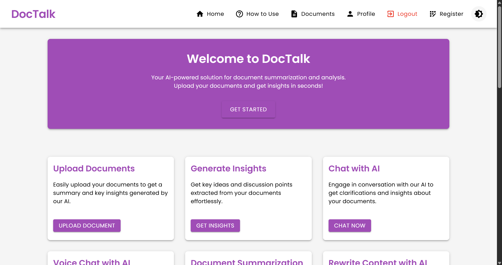
</p>

### **Landing Page - Dark Mode**

<p align="center">
  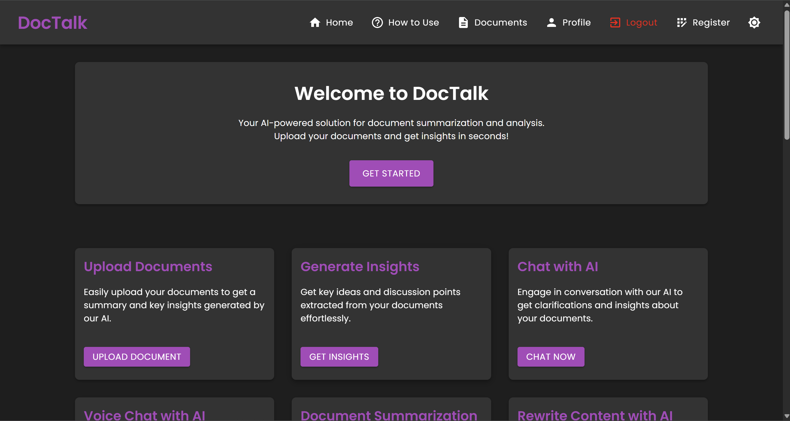
</p>

### **Document Upload Page**

<p align="center">
  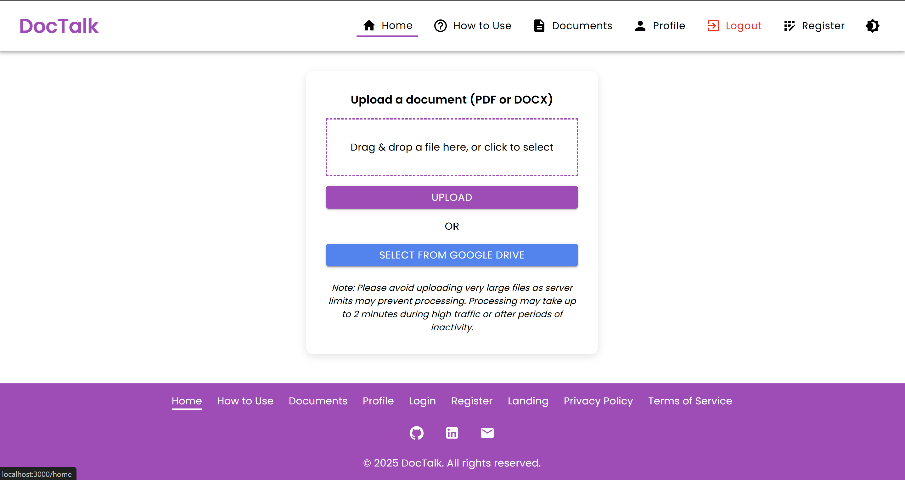
</p>

### **Document Upload Page - Dark Mode**

<p align="center">
  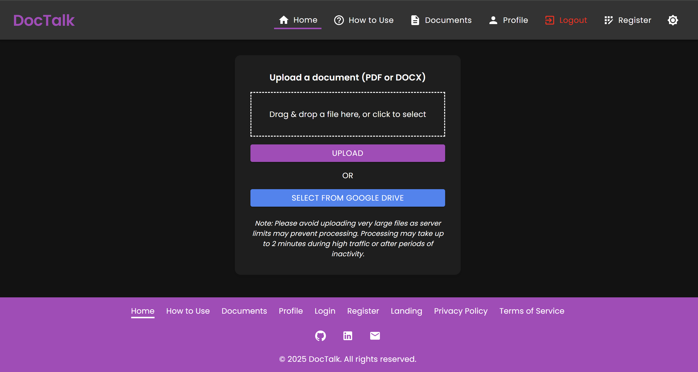
</p>

### **Document Upload Page - Document Uploaded**

<p align="center">
  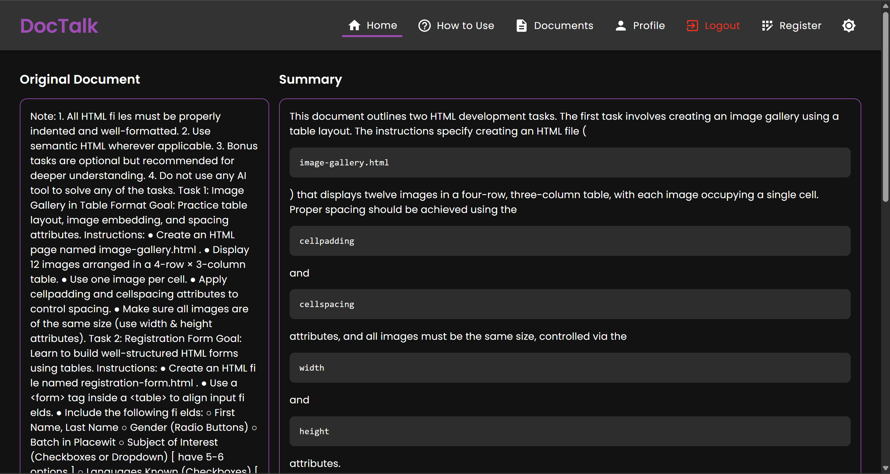
</p>

### **Google Drive Document Selection**

<p align="center">
  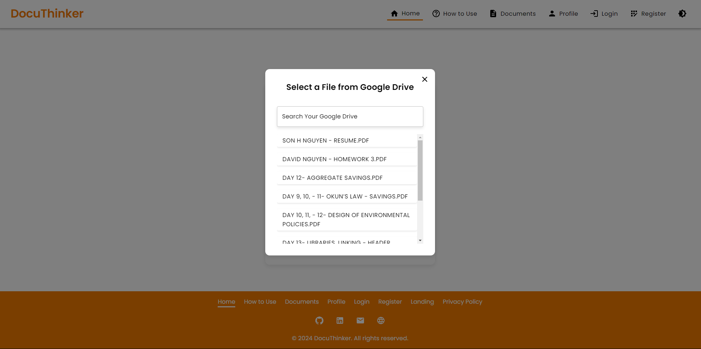
</p>

### **Chat Modal**

<p align="center">
  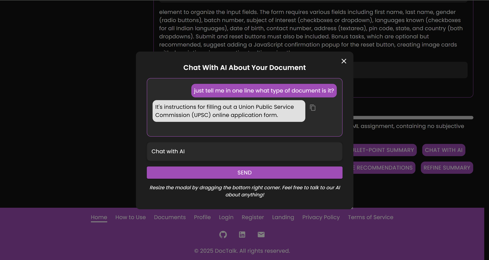
</p>

### **Documents Page**

<p align="center">
  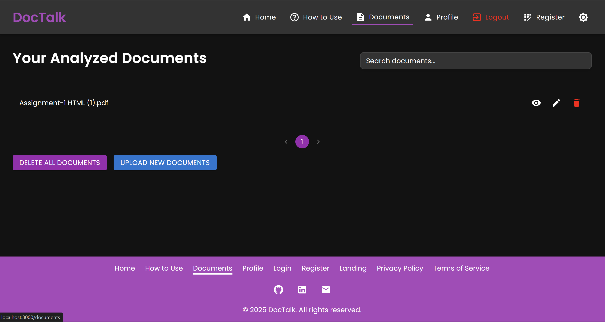
</p>

### **Profile Page**

<p align="center">
  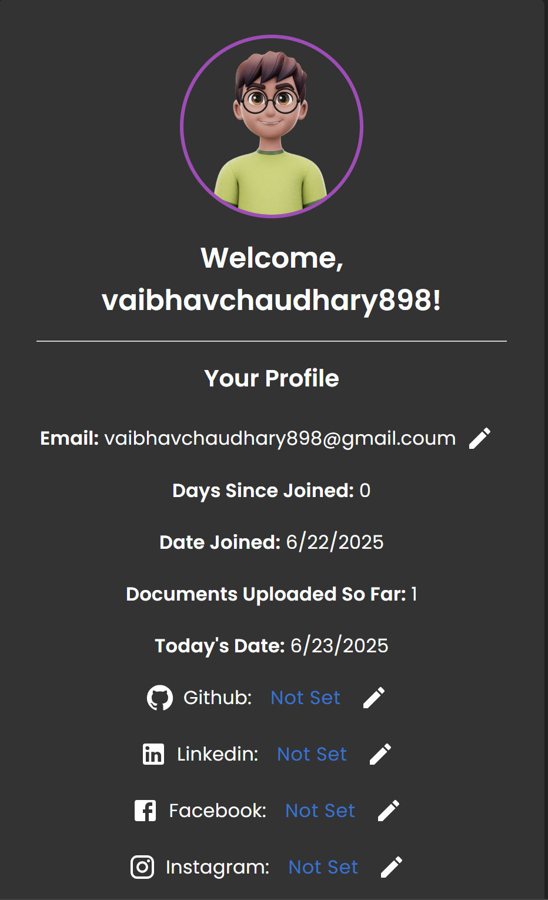
</p>

### **How To Use Page**

<p align="center">
  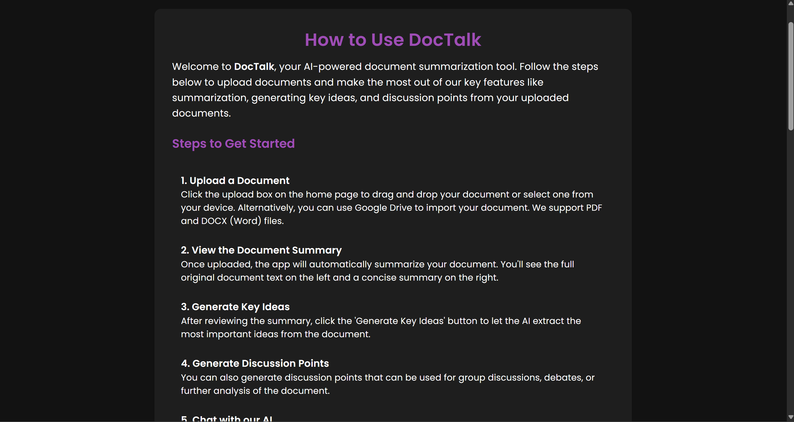
</p>

### **Login Page**

<p align="center">
  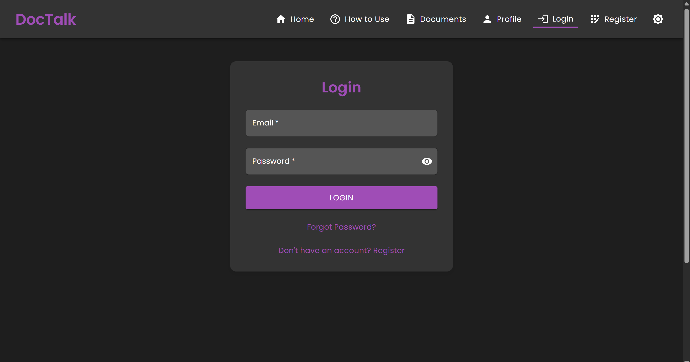
</p>

### **Registration Page**

<p align="center">
  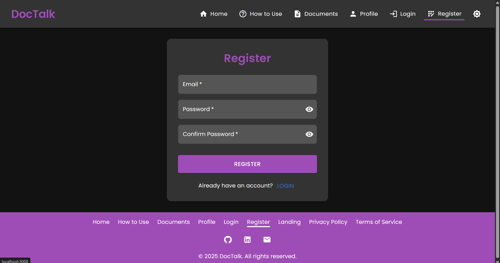
</p>

<h2 id="getting-started">🛠️ Getting Started</h2>

### **Prerequisites**

Ensure you have the following tools installed:

- **Node.js** (between v14 and v20)
- **npm** or **yarn**
- **Firebase Admin SDK** credentials
- **Redis** for caching
- **MongoDB** for data storage
- **RabbitMQ** for handling asynchronous tasks
- **Postman** for API testing (optional)
- **React Native CLI** for building the mobile app
- **Firebase SDK** for mobile app integration
- **Firebase API Keys and Secrets** for authentication
- **Tailwind CSS** for styling the frontend
- **.env** file with necessary API keys (You can contact me to get the `.env` file - but you should obtain your own API keys for production).

### **Frontend Installation**

1. **Clone the repository**:

   ```bash
   git clone https://github.com/cicada3298/DocTalk.git
   cd DocTalk/backend
   ```

2. **Navigate to the frontend directory**:

   ```bash
   cd frontend
   ```

3. **Install dependencies**:

   ```bash
   npm install
   ```

   Or `npm install --legacy-peer-deps` if you face any peer dependency issues.

4. **Start the Frontend React app**:
   ```bash
   npm start
   ```
5. **Build the Frontend React app (for production)**:

   ```bash
   npm run build
   ```

6. **Alternatively, you can use `yarn` to install dependencies and run the app**:
   ```bash
   yarn install
   yarn start
   ```
7. **Or, for your convenience, if you have already installed the dependencies, you can directly run the app in the root directory using**:

   ```bash
   npm run frontend
   ```

8. **The app's frontend will run on `http://localhost:3000`**. You can now access it in your browser.

### **Backend Installation**

1. **Navigate to the root (not `backend`) directory**:
   ```bash
   cd backend
   ```
2. **Install dependencies**:

   ```bash
   npm install
   ```

   Or `npm install --legacy-peer-deps` if you face any peer dependency issues.

3. **Start the backend server**:
   ```bash
   npm run server
   ```
4. **The backend server will run on `http://localhost:3001`**. You can access the API endpoints in your browser or **Postman**.
5. **Additionally, the backend code is in the `backend` directory**. Feel free to explore the API endpoints and controllers.

<h2 id="api-endpoints">📋 API Endpoints</h2>

The backend of **DocTalk** provides several API endpoints for user authentication, document management, and AI-powered insights. These endpoints are used by the frontend to interact with the backend server:

| **Method** | **Endpoint**                         | **Description**                                                                                     |
| ---------- | ------------------------------------ | --------------------------------------------------------------------------------------------------- |
| POST       | `/register`                          | Register a new user in Firebase Authentication and Firestore, saving their email and creation date. |
| POST       | `/login`                             | Log in a user and return a custom token along with the user ID.                                     |
| POST       | `/upload`                            | Upload a document for summarization. If the user is logged in, the document is saved in Firestore.  |
| POST       | `/generate-key-ideas`                | Generate key ideas from the document text.                                                          |
| POST       | `/generate-discussion-points`        | Generate discussion points from the document text.                                                  |
| POST       | `/chat`                              | Chat with AI using the original document text as context.                                           |
| POST       | `/forgot-password`                   | Reset a user's password in Firebase Authentication.                                                 |
| POST       | `/verify-email`                      | Verify if a user's email exists in Firestore.                                                       |
| GET        | `/documents/{userId}`                | Retrieve all documents associated with the given `userId`.                                          |
| GET        | `/documents/{userId}/{docId}`        | Retrieve a specific document by `userId` and `docId`.                                               |
| GET        | `/document-details/{userId}/{docId}` | Retrieve document details (title, original text, summary) by `userId` and `docId`.                  |
| DELETE     | `/delete-document/{userId}/{docId}`  | Delete a specific document by `userId` and `docId`.                                                 |
| DELETE     | `/delete-all-documents/{userId}`     | Delete all documents associated with the given `userId`.                                            |
| POST       | `/update-email`                      | Update a user's email in both Firebase Authentication and Firestore.                                |
| POST       | `/update-password`                   | Update a user's password in Firebase Authentication.                                                |
| GET        | `/days-since-joined/{userId}`        | Get the number of days since the user associated with `userId` joined the service.                  |
| GET        | `/document-count/{userId}`           | Retrieve the number of documents associated with the given `userId`.                                |
| GET        | `/user-email/{userId}`               | Retrieve the email of a user associated with `userId`.                                              |
| POST       | `/update-document-title`             | Update the title of a document in Firestore.                                                        |
| PUT        | `/update-theme`                      | Update the theme of the app.                                                                        |
| GET        | `/user-joined-date/{userId}`         | Get date when the user associated with `userId` joined the service.                                 |
| GET        | `/social-media/{userId}`             | Get the social media links of the user associated with `userId`.                                    |
| POST       | `/update-social-media`               | Update the social media links of the user associated with `userId`.                                 |
| POST       | `/update-profile`                    | Update the user's profile information.                                                              |
| POST       | `/update-document/{userId}/{docId}`  | Update the document details in Firestore.                                                           |
| POST       | `/update-document-summary`           | Update the summary of a document in Firestore.                                                      |
| POST       | `/sentiment-analysis`                | Analyzes the sentiment of the provided document text                                                |
| POST       | `/bullet-summary`                    | Generates a summary of the document text in bullet points                                           |
| POST       | `/summary-in-language`               | Generates a summary in the specified language                                                       |
| POST       | `/content-rewriting`                 | Rewrites or rephrases the provided document text based on a style                                   |
| POST       | `/actionable-recommendations`        | Generates actionable recommendations based on the document text                                     |

### API Documentation

- **Swagger Documentation**: You can access the Swagger documentation for all API endpoints by running the backend server and navigating to `http://localhost:3001/api-docs`.
- **Redoc Documentation**: You can access the Redoc documentation for all API endpoints by running the backend server and navigating to `http://localhost:3001/api-docs/redoc`.

For example, our API endpoints documentation looks like this:

<p align="center">
  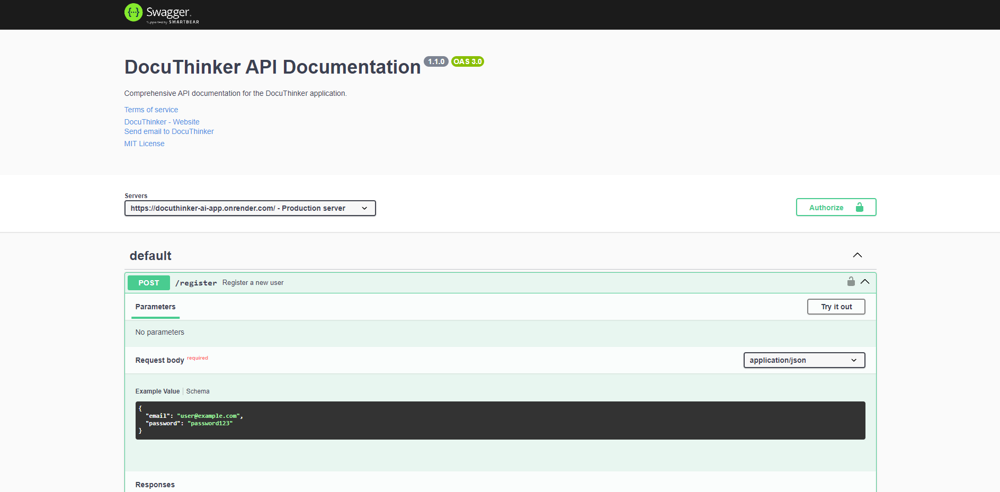
</p>

This will generate TypeScript files for the API endpoints in the `api` directory. Feel free to replace or modify the command as needed.

### Using the `openapi.yaml` File

1. **View the API Documentation**

- Open [Swagger Editor](https://editor.swagger.io/).
- Upload the `openapi.yaml` file or paste its content.
- Visualize and interact with the API documentation.

2. **Test the API**

- Import `openapi.yaml` into [Postman](https://www.postman.com/):
  - Open Postman → Import → Select `openapi.yaml`.
  - Test the API endpoints directly from Postman.
- Or use [Swagger UI](https://swagger.io/tools/swagger-ui/):
  - Provide the file URL or upload it to view and test endpoints.

3. **Generate Client Libraries**

- Install OpenAPI Generator:
  ```bash
  npm install @openapitools/openapi-generator-cli -g
  ```
- Generate a client library:
  ```bash
  openapi-generator-cli generate -i openapi.yaml -g <language> -o ./client
  ```
- Replace `<language>` with the desired programming language.

4. **Generate Server Stubs**

- Generate a server stub:
  ```bash
  openapi-generator-cli generate -i openapi.yaml -g <framework> -o ./server
  ```
- Replace `<framework>` with the desired framework.

5. **Run a Mock Server**

- Install Prism:
  ```bash
  npm install -g @stoplight/prism-cli
  ```
- Start the mock server:
  ```bash
  prism mock openapi.yaml
  ```

6. **Validate the OpenAPI File**

- Use [Swagger Validator](https://validator.swagger.io/):
  - Upload `openapi.yaml` or paste its content to check for errors.

### **API Architecture**

- We use **Node.js** and **Express** to build the backend server for **DocTalk**.
- The backend API is structured using **Express** and **Firebase Admin SDK** for user authentication and data storage.
- We use the MVC (Model-View-Controller) pattern to separate concerns and improve code organization.
  - **Models**: Schema definitions for interacting with the database.
  - **Controllers**: Handle the business logic and interact with the models.
  - **Views**: Format the output and responses for the API endpoints.
  - **Services**: Interact with the database and AI/ML services for document analysis and summarization.
  - **Middlewares**: Secure routes with Firebase authentication and JWT middleware.
- The API endpoints are designed to be RESTful and follow best practices for error handling and response formatting.
- The **Microservices Architecture** is also used to handle asynchronous tasks and improve scalability.
- The API routes are secured using Firebase authentication middleware to ensure that only authenticated users can access the endpoints.
- The API controllers handle the business logic for each route, interacting with the data models and formatting the responses.

### **API Testing**

- You can test the API endpoints using **Postman** or **Insomnia**. Simply make a POST request to the desired endpoint with the required parameters.
- For example, you can test the `/upload` endpoint by sending a POST request with the document file as a form-data parameter.
- Feel free to test all the API endpoints and explore the functionalities of the app.

#### Example Request to Register a User:

```bash
curl --location --request POST 'http://localhost:3000/register' \
--header 'Content-Type: application/json' \
--data-raw '{
    "email": "test@example.com",
    "password": "password123"
}'
```

#### Example Request to Upload a Document:

```bash
curl --location --request POST 'http://localhost:3000/upload' \
--header 'Authorization: Bearer <your-token>' \
--form 'File=@"/path/to/your/file.pdf"'
```

### **Error Handling**

The backend APIs uses centralized error handling to capture and log errors. Responses for failed requests are returned with a proper status code and an error message:

```json
{
  "error": "An internal error occurred",
  "details": "Error details go here"
}
```


<h2 id="author">👨‍💻 Author</h2>

Here are some information about me:

- **[Vaibhav Chaudhary](https://github.com/cicada3298)** - An aspiring Software Developer
- Feel free to connect with me on **[LinkedIn](https://www.linkedin.com/in/vaibhavchaudhary898/)**.

---

**Happy Coding and Analyzing! 🚀**

---

[🔝 Back to Top](#DocTalk---ai-powered-document-analysis-and-summarization-app)
